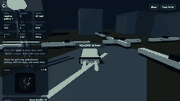
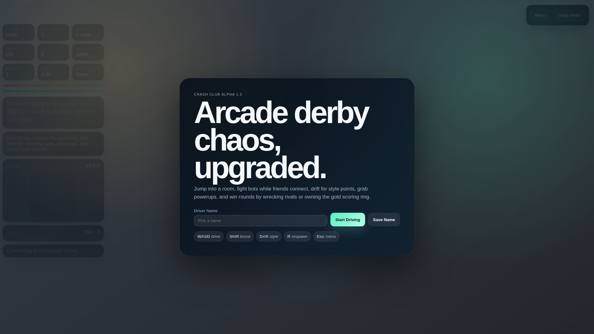
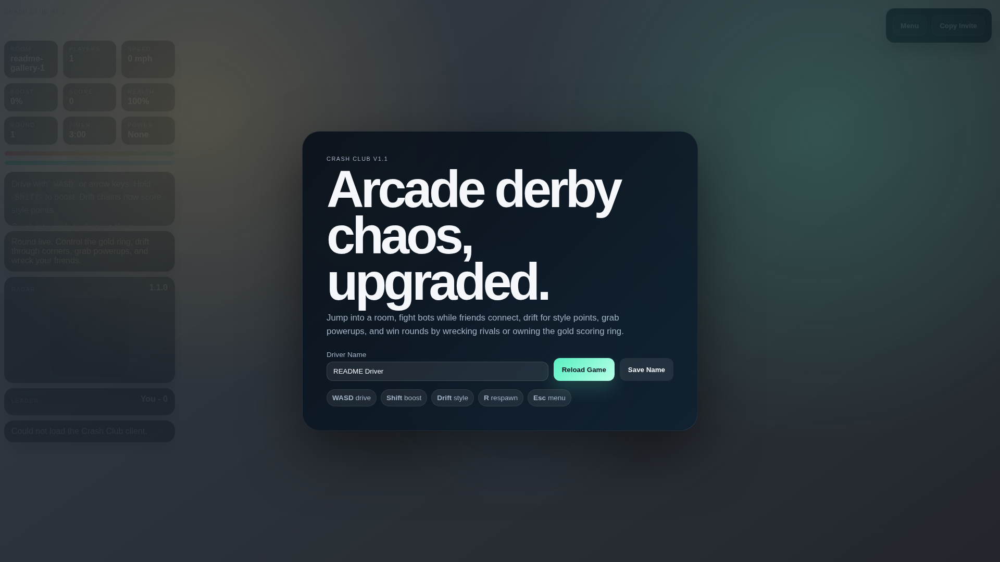
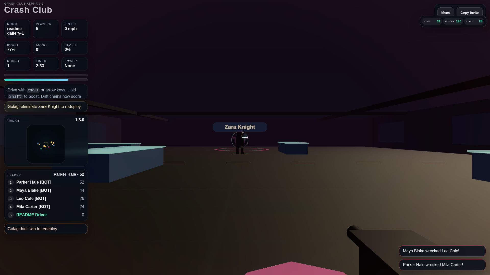
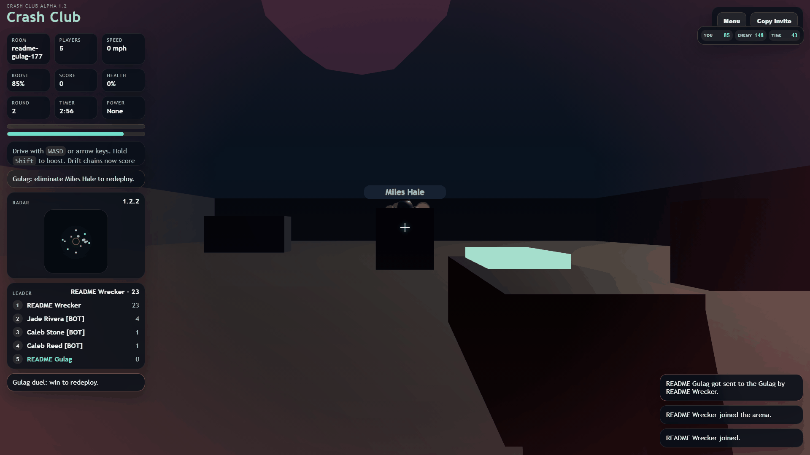
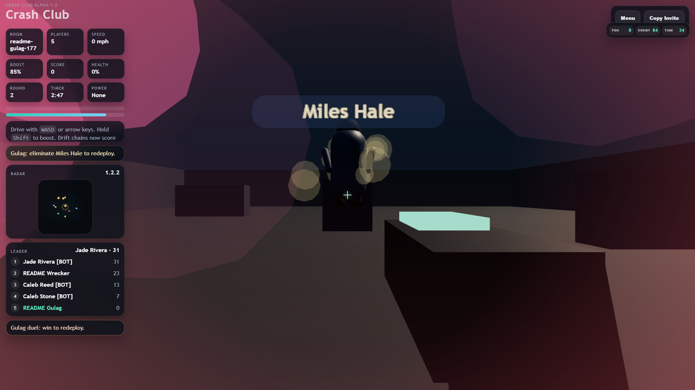

# Crash Club

<p align="center">
  
</p>

<p align="center">
  <strong>A multiplayer 3D browser driving arena built for quick Wi-Fi chaos.</strong>
</p>

<p align="center">
  Pick a name, share a room URL, grab glowing powerups, fight bots while friends connect,
  and throw tiny low-poly cars around a score-chasing crash arena.
</p>

<p align="center">
  
  
  
  
  
</p>

> Every gameplay screenshot and GIF below was captured from the real browser game running in Crash Club Alpha 1.3. No mockup screenshots, no fake rendered cards.

## Gameplay Preview

<p align="center">
  
</p>

Crash Club is meant to feel instantly playable: open the page, type a driver name, hit Start Driving, and you are in a live arena. The game runs in the browser with a Node.js WebSocket server handling rooms, bots, scoring, pickups, damage, and round flow.

The core loop is simple on purpose. Drive into the arena, own the gold scoring ring, grab powerups before rivals do, and smash other cars hard enough to climb the leaderboard.

## Feature Tour

### Start Screen And Controls

<p align="center">
  
</p>

The first screen gives the game a real release feel instead of dropping players into a blank test canvas. Players can choose a name, save it, start driving, and see the main control hints before the match begins.

| Action | Keyboard | Touch |
| --- | --- | --- |
| Drive forward | `W` or `ArrowUp` | `Gas` |
| Brake/reverse | `S` or `ArrowDown` | `Brake` |
| Turn left | `A` or `ArrowLeft` | `Left` |
| Turn right | `D` or `ArrowRight` | `Right` |
| Boost | `Shift` | `Boost` |
| Respawn | `R` | `Reset` |
| Menu | `Esc` | `Menu` |
| Shoot in Gulag | `Click`, `Space`, or `F` | Tap/click |
| Free-cam height | `Q` / `E` | Keyboard only |

### Live Arena HUD

<p align="center">
  
</p>

The HUD keeps the match readable while the 3D arena stays visible. It shows room code, player count, speed, boost, score, health, round number, timer, active power, radar, objective text, leaderboard, and connection messages.

This is also where the game starts to feel like a real multiplayer prototype instead of just a car controller. You can see other racers joining, bots filling the lobby, and the match state updating while you drive.

### Powerups And Score Ring

<p align="center">
  
</p>

The gold ring gives everyone a reason to fight for the middle of the map. Staying in the ring scores points, but sitting still makes you an easy target, so players have to keep moving.

Powerups spawn as glowing pickups around the arena. Current pickup types include boost, repair, shield, and slam. They are visible in the world and on the radar, so players can chase them intentionally instead of guessing what the server is doing.

### Bots, Radar, And Multiplayer Rooms

<p align="center">
  
</p>

Crash Club automatically fills active rooms with bot racers so solo testing still feels alive. When friends join the same room URL, the same systems handle their cars too.

Rooms are URL-based, which keeps sharing simple. A room like `?room=after-school` lets multiple devices on the same Wi-Fi join the same match when they connect to the host machine.

### Gulag Duels And Redeploys

<p align="center">
  
</p>

The Gulag is Crash Club's second-chance system. When a human player loses all health in the arena, the server switches that player out of normal driving mode and sends them into a first-person duel instead of instantly respawning them.

Inside the Gulag, the car game becomes a compact shooter. The player gets a crosshair, a weapon view, a humanoid rival, health, enemy health, and a timer. Movement uses `WASD`, aiming uses the mouse, and shooting works with click, `Space`, or `F`.

Winning the duel sends the player back into the arena with a redeploy bonus. Losing the duel, dying to the opponent, or timing out sends the player into spectator free cam so they can keep watching the match without interrupting the live round.

<p align="center">
  
</p>

### Driving Feel

<p align="center">
  
</p>

The driving is arcade-style rather than simulator-style. Cars accelerate quickly, boost gives a burst of speed, braking can reverse, and turning at speed can kick into drift-style movement.

The map uses roads, cones, guardrails, street lights, buildings, lane stripes, glowing pickups, and a dark arena sky to make the space easier to read while staying lightweight enough for normal laptops.

### Top 3 Podium Ceremony

When a round ends, the game now cuts away from the frozen arena into a dedicated victory ceremony. The server locks in the final top three standings, then every browser renders the same podium with the correct driver names, scores, and matching car colors.

The podium scene gives the round a real finish: cars drop onto first, second, and third place blocks, the camera floats around the winners, confetti falls, and the next round starts after the intermission.

## Game Rules

| Rule | What It Means |
| --- | --- |
| Round timer | Each round lasts 3 minutes unless someone reaches the target score first. |
| Target score | The first player to the target score wins immediately. |
| Podium | The final top three get a cinematic podium ceremony before the next round. |
| Center ring | Staying inside the gold ring gives steady points. |
| Pickups | Boost, repair, shield, and slam create tactical moments. |
| Damage | Faster impacts deal more damage. |
| Wrecks | Destroying another car gives a larger score bonus. |
| Gulag | Human players who lose all health enter a first-person second-chance duel. |
| Redeploy | Winning the Gulag respawns the player back into the arena with a bonus. |
| Spectator | Losing or timing out in the Gulag moves the player into free cam. |
| Shield | Reduces incoming damage for a short window. |
| Slam | Powers up your next big hit. |
| Respawn | Press `R` to reset while still alive in the arena. |

## Quick Start

Crash Club runs with a tiny setup: install dependencies, start the Node server, and open the browser.

```powershell
npm.cmd install
npm.cmd start
```

Open the game:

```text
http://localhost:3000
http://localhost:3000?room=after-school
```

To play with other devices on the same Wi-Fi, use your computer's LAN address instead of `localhost`, then keep the same `?room=` code.

Check server status:

```text
http://localhost:3000/health
```

If the browser ever acts weird after an update, press `Ctrl + F5` once to force fresh game files.

## Tech Stack

| Layer | Choice | Why |
| --- | --- | --- |
| Server | Node.js | Easy to run locally and easy to inspect. |
| Realtime | WebSockets via `ws` | Simple low-latency room updates. |
| Rendering | Three.js | Browser-native 3D without a heavy engine install. |
| UI | HTML/CSS overlay | Keeps HUD and menus separate from the 3D scene. |
| Assets | SVG, PNG, GIF, generated client chunks | Lightweight files that GitHub can display and serve. |

## Project Structure

```text
crash-club/
  |-- server.js                    # Static hosting, rooms, bots, pickups, scoring, damage, podium standings
|-- public/
|   |-- index.html               # HUD, menu, radar, controls, and page shell
|   |-- styles.css               # Menus, HUD, meters, mobile layout, and overlays
|   |-- app.js                   # Three.js client, driving, pickups, modes, and HUD logic
|   |-- app.bundle.*.txt         # Generated Three.js game client chunks
|   |-- favicon.svg              # Browser tab icon
|   |-- manifest.webmanifest     # Install metadata
|   `-- og-image.svg             # Social preview image
|-- assets/
|   |-- crash-club-banner.svg    # Main GitHub banner
|   |-- crash-club-logo.svg      # Square logo
|   |-- crash-club-wordmark.svg
|   `-- readme/
|       `-- github/              # Real screenshots and gameplay GIF used in this README
|-- scripts/
|   |-- capture-readme-media.js  # Browser capture helper for README arena media
|   `-- capture-gulag-readme.js  # Browser capture helper for README Gulag media
|-- package.json
`-- README.md
```

## Roadmap

Crash Club Alpha 1.3 is playable, but there is a lot of room to make it bigger.

| Priority | Upgrade | Why It Matters |
| --- | --- | --- |
| 1 | Server-authoritative collision checks | Makes multiplayer hits fairer and harder to spoof. |
| 2 | Derby, king-of-the-ring, and stunt race modes | Gives the same arena multiple ways to play. |
| 3 | Larger map districts | Adds landmarks, routes, shortcuts, and chase moments. |
| 4 | More powerups like oil slick, jump, magnet, and shockwave | Creates more chaos and comeback potential. |
| 5 | Car cosmetics and nameplates | Makes players easier to recognize and more fun to customize. |
| 6 | Proper source build pipeline | Makes future gameplay edits safer than patching generated chunks. |

## 🚫 License & Usage

Copyright © FlowzyGames. All rights reserved.

This project and all associated source code, assets, and content are the intellectual property of Flowzy Games.

✅ Permitted Use

You are permitted to:

View this repository for educational and reference purposes
Download and run the project for personal, non-commercial use only (e.g., playing the game)
❌ Prohibited Use

You may NOT:

Copy, modify, or distribute any part of this project
Use this code, assets, or concepts in your own projects
Reupload, republish, or claim this project as your own work
Use this project or any part of it for commercial purposes
⚖️ No License Granted

No rights or licenses are granted to use, reproduce, or distribute this project beyond what is explicitly stated above.

Unauthorized use of this project may result in takedown requests or further legal action.

📩 Permissions

For permission requests, please contact FlowzyGames.
