<p align="center">
  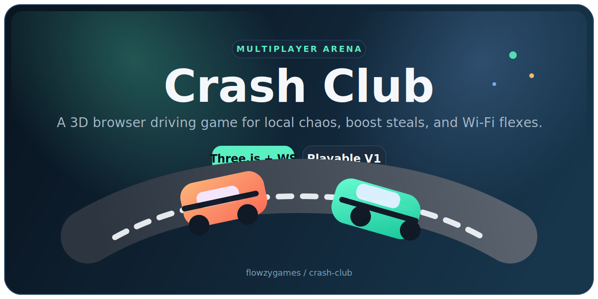
</p>

<h1 align="center">Crash Club</h1>

<p align="center">
  <strong>A multiplayer 3D browser driving arena built for quick Wi-Fi chaos.</strong>
</p>

<p align="center">
  Pick a name, share a room URL, and throw tiny low-poly cars into a score-chasing crash arena with bots,
  pickups, round timers, radar, damage, and instant browser play.
</p>

<p align="center">
  
  
  
  
  
</p>

<p align="center">
  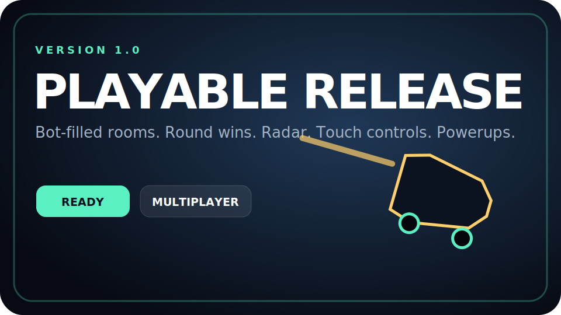
</p>

## Release 1.0

<p align="center">
  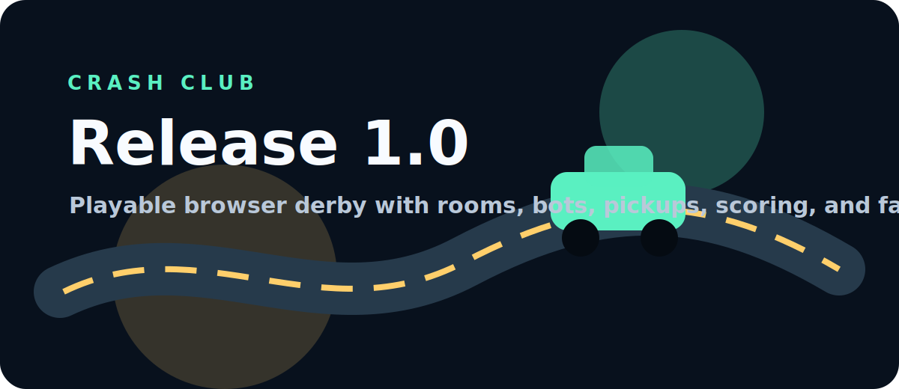
  
</p>

`Crash Club` is a playable v1.0 browser game, not just a loose driving demo. It has a start screen, active multiplayer rooms, bot opponents, round flow, HUD feedback, powerups, scoring, and a compact arena designed to get people playing quickly.

The goal of this release is simple: open a browser, start a local Node server, send a room link to friends on the same Wi-Fi, and immediately have something that feels like a small arcade cabinet. It is intentionally lightweight so it stays easy to read, modify, and remix.

## Why It Stands Out

<p align="center">
  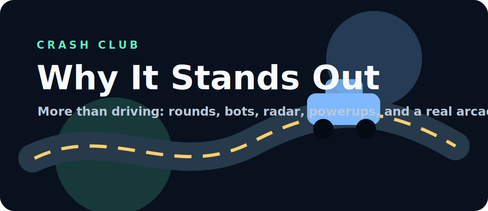
  
</p>

Most tiny browser car projects stop at "you can drive around." Crash Club pushes further by wrapping the driving inside an actual match loop. There are rooms, bots, timed rounds, health, boosts, shields, slam hits, wreck scoring, radar, mobile controls, and status feedback.

The best part is that it still stays approachable. There is no giant framework wall, no account system, and no asset pipeline required just to experiment. It is the kind of project you can show someone, play immediately, and then keep expanding piece by piece.

- Real-time rooms use WebSockets so multiple players can share the same arena.
- Bot racers fill empty rooms so solo testing still feels alive.
- The arena has roads, guardrails, scoring zones, cones, visible pickups, and a readable sky pass.
- The HUD shows speed, boost, health, score, powerup state, timer, leaderboard, radar, and connection status.
- The setup stays small: install dependencies, run Node, open the browser.

## Gameplay

<p align="center">
  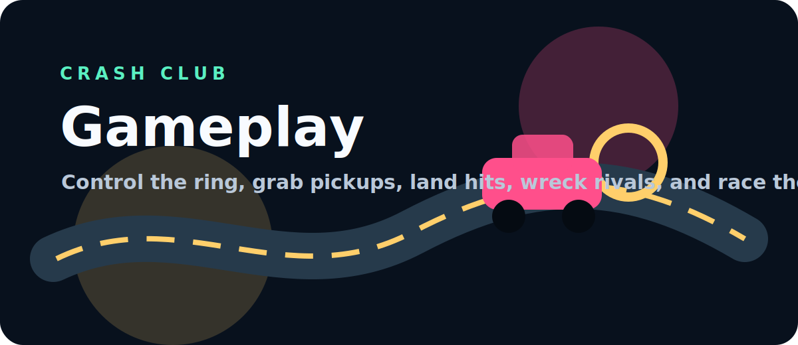
  
</p>

The core loop is built around fast decisions instead of complicated rules. You drive into the arena, chase the gold scoring ring, grab pickups before rivals do, and ram other cars hard enough to turn collisions into points.

Every round creates a little story. One player might camp the ring, another might chase shield pickups, a bot might steal repair at the worst possible moment, and a last-second slam hit can flip the leaderboard. The game is arcade-simple, but the scoring gives players reasons to move instead of just wandering around.

- Control the center ring for steady passive points.
- Grab boost, repair, shield, and slam pickups for tactical swings.
- Crash into rivals to deal damage and earn hit points.
- Wreck opponents for bigger score bursts.
- Respawn quickly and get back into the match instead of sitting out.
- Win by reaching the target score or leading when the timer ends.

## Version 1.0 Features

Version 1.0 focuses on making the whole thing feel complete from boot to match end. The release screen gives the game a clean first impression, the room system makes sharing easy, and the HUD keeps the action understandable while the 3D scene stays visible.

This is also the first version where the game has enough systems to feel expandable. Pickups, scoring, health, bots, and round phases are all separate concepts, which makes future modes and maps much easier to add.

- Bot-filled rooms target four racers so matches do not feel empty.
- Timed rounds include intermission, winner banners, and persistent round wins.
- Radar shows your car, rivals, bots, and active pickups.
- Health, boost, powerup timers, and damage vignette make feedback readable.
- Copy Invite creates a shareable room URL.
- Touch controls appear automatically on narrow screens.
- `/health` reports server status, version, and room count.

## Arcade Flavor

<p align="center">
  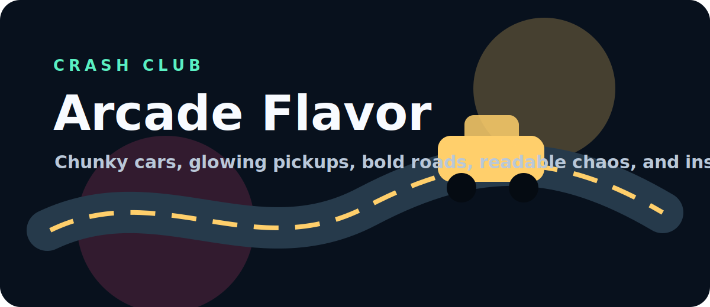
  
</p>

Crash Club is supposed to feel loud, readable, and a little ridiculous. The cars are chunky, the pickups glow, the ring is obvious, and the arena is shaped so players naturally meet in the middle instead of drifting forever.

The visual style is intentionally low-poly and browser-friendly. That means it can run on normal school or home laptops while still having enough personality to show off. It is not trying to be realistic; it is trying to be instantly playable.

- Neon-style pickup beacons make powerups easier to find.
- Roads and lane markers make the map feel less like a flat green plane.
- Guardrails and cones give the arena stronger shape and depth.
- Camera follow, impact feedback, audio blips, and toast messages sell the arcade feel.
- The center ring turns the map into a fight zone instead of an empty sandbox.

## Controls

<p align="center">
  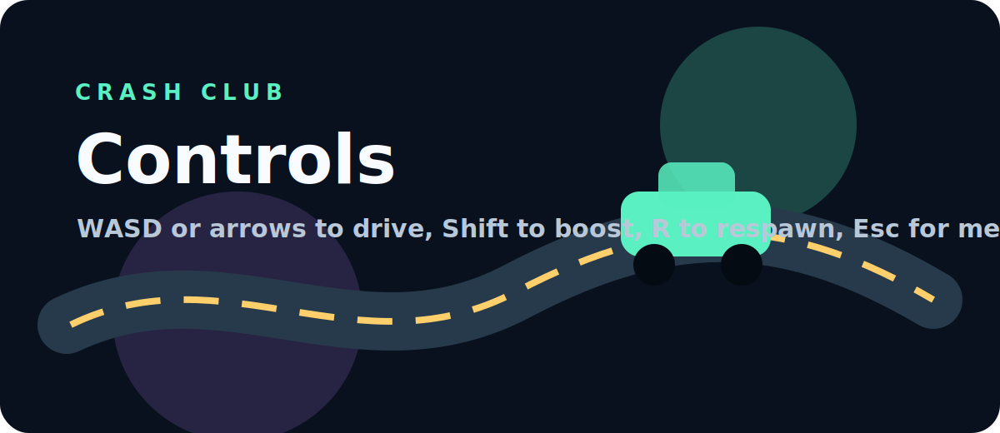
  
</p>

The controls are intentionally simple so new players can join without learning a simulation. Acceleration, braking, turning, boost, respawn, and menu access are all mapped to familiar keys, with touch buttons available on smaller screens.

| Action | Keyboard | Touch |
| --- | --- | --- |
| Drive forward | `W` or `ArrowUp` | `Gas` |
| Brake/reverse | `S` or `ArrowDown` | `Brake` |
| Turn left | `A` or `ArrowLeft` | `Left` |
| Turn right | `D` or `ArrowRight` | `Right` |
| Boost | `Shift` | `Boost` |
| Respawn | `R` | `Reset` |
| Menu | `Esc` | `Menu` |

Tip: boost is strongest when you are already pointed where you want to go. The speed cap keeps the map readable, but boost still gives enough punch to win races to pickups or land a harder crash.

## Game Rules

<p align="center">
  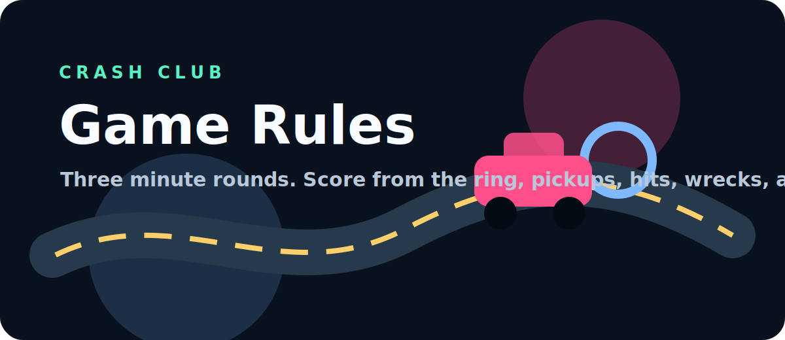
  
</p>

Rounds are short so the game keeps moving. You score by controlling space, grabbing powerups, and hitting other cars. Health and wrecks make impacts matter, while respawn keeps the match from turning into a waiting room.

| Rule | What It Means |
| --- | --- |
| Round timer | Each round lasts 3 minutes unless someone reaches the target score first. |
| Target score | The first player to the target score wins immediately. |
| Center ring | Staying inside the gold ring gives steady points. |
| Pickups | Boost, repair, shield, and slam create small tactical moments. |
| Damage | Faster impacts deal more damage. |
| Wrecks | Destroying another car gives a larger score bonus. |
| Shield | Reduces incoming damage for a short window. |
| Slam | Powers up your next big hit. |

## Quick Start

<p align="center">
  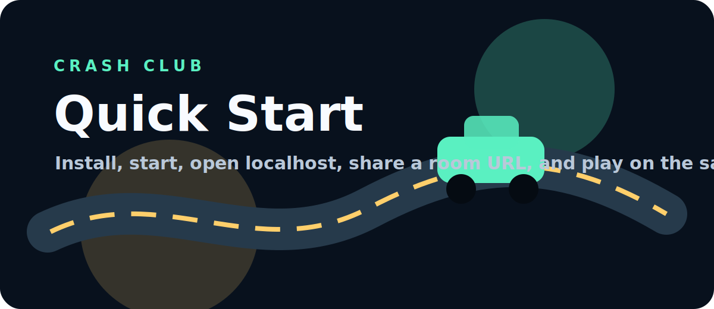
  
</p>

Crash Club is designed to run locally with almost no ceremony. If Node is installed, the whole game starts from one command and serves the static client, WebSocket server, and health endpoint from the same process.

```powershell
npm.cmd install
npm.cmd start
```

Open the game:

```text
http://localhost:3000
http://localhost:3000?room=after-school
```

To play with other devices on the same Wi-Fi, use your computer's local network address instead of `localhost`, then keep the same `?room=` code. The room code is what puts everyone in the same match.

Check the server:

```text
http://localhost:3000/health
```

If the browser ever acts weird after an update, press `Ctrl + F5` once to force fresh game files.

## Stack

<p align="center">
  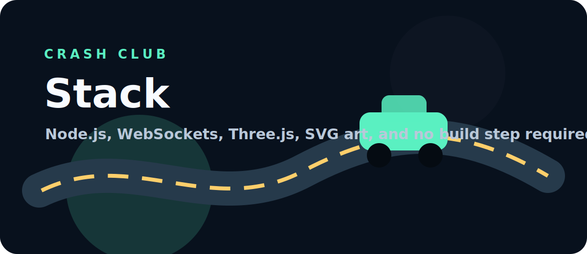
  
</p>

The stack is intentionally small and transparent. The server is plain Node, multiplayer uses the `ws` package, and the 3D client is rendered with Three.js in the browser. There is no bundler step required to play the current release.

| Layer | Choice | Why |
| --- | --- | --- |
| Server | Node.js | Easy to run locally and easy to inspect. |
| Realtime | WebSockets via `ws` | Simple room state and low-latency player updates. |
| Rendering | Three.js | Browser-native 3D with a huge ecosystem. |
| UI | HTML/CSS overlay | Keeps HUD readable and separate from the 3D scene. |
| Assets | SVG + generated bundle chunks | Lightweight files that GitHub can display and serve. |

## Project Structure

<p align="center">
  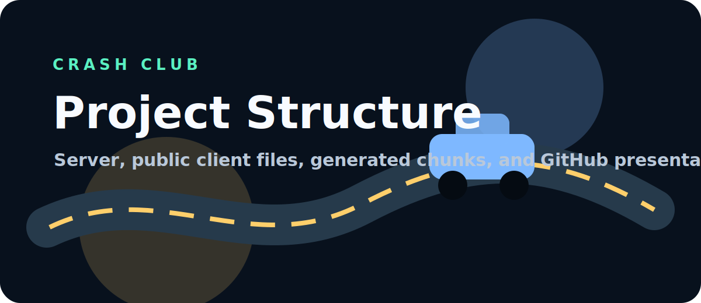
  
</p>

The repo is small enough to understand quickly. Server code, public browser files, and project art are separated so it is clear where to look when changing gameplay, HUD, or GitHub presentation.

```text
crash-club/
|-- server.js                    # Static hosting, rooms, bots, pickups, scoring, damage
|-- public/
|   |-- index.html               # HUD, menu, radar, controls, and page shell
|   |-- styles.css               # Visual styling for menus, HUD, meters, and mobile layout
|   |-- app.js                   # Client loader, cache busting, bundle safety patches
|   |-- app.bundle.*.txt         # Generated Three.js game client chunks
|   |-- favicon.svg              # Browser tab icon
|   |-- manifest.webmanifest     # Install metadata
|   `-- og-image.svg             # Social preview image
|-- assets/
|   |-- crash-club-banner.svg    # Main GitHub banner
|   |-- crash-club-logo.svg      # Square logo
|   |-- crash-club-release-card.svg
|   |-- crash-club-wordmark.svg
|   `-- readme/                  # Section images and GIFs used in this README
|-- package.json
`-- README.md
```

## Roadmap

<p align="center">

</p>

Crash Club has a strong v1.0 foundation, but there is a lot of room to push it from a fun local arena into a bigger browser game. The next improvements should focus on deeper collision authority, better maps, more reasons to chase players, and stronger personalization.

| Priority | Upgrade | Why It Matters |
| --- | --- | --- |
| 1 | Server-authoritative collision checks | Makes multiplayer hits fairer and harder to spoof. |
| 2 | Derby, king-of-the-ring, and stunt race modes | Gives the same arena multiple ways to play. |
| 3 | Larger map districts | Adds landmarks, routes, shortcuts, and chase moments. |
| 4 | More powerups like oil slick, jump, magnet, and shockwave | Creates more chaos and comeback potential. |
| 5 | Car cosmetics and nameplates | Makes players easier to recognize and more fun to customize. |
| 6 | Proper source build pipeline | Makes future gameplay edits safer than patching generated chunks. |

## License

MIT. See [`LICENSE`](./LICENSE).
