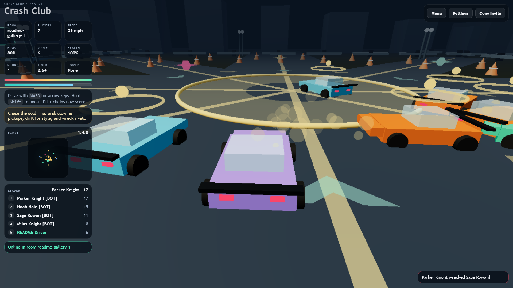
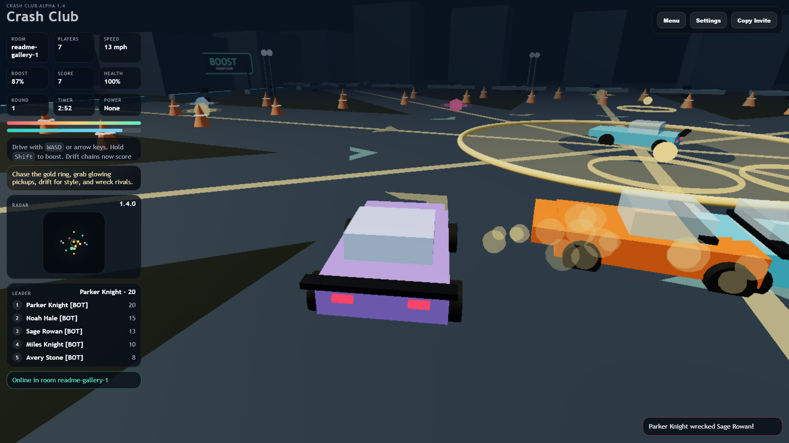
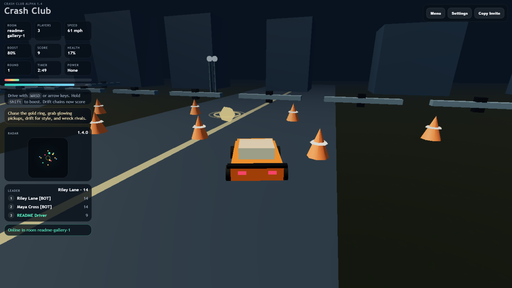

# Crash Club

<p align="center">
  
</p>

<p align="center">
  <strong>A multiplayer 3D browser driving arena built for quick browser chaos.</strong>
</p>

<p align="center">
  Pick a name, share a room URL, grab glowing powerups, wreck rivals, survive the Gulag,
  and fight for a top-three podium finish in a low-poly arcade arena.
</p>

<p align="center">
  
  
  
  
  
</p>

> The gameplay screenshots and GIFs below are real browser captures from Crash Club, not mockups. Alpha 1.4 focuses on smoother performance, settings, sound, and driving feel while keeping the same public feature set.

## Gameplay Preview

<p align="center">
  
</p>

Crash Club is designed to be instantly playable: start the Node server, open the browser, choose a driver name, and drive into a live arena. The browser handles rendering and input while the WebSocket server handles rooms, bots, pickups, damage, scoring, the Gulag, and round flow.

The core loop is simple on purpose. Own the gold scoring ring, grab powerups before rivals do, land heavy hits, score style from drifting, and try to finish each round on the podium.

## New In Alpha 1.4

<p align="center">
  
</p>

Alpha 1.4 is a performance and feel pass. The goal is not just adding more stuff, but making the game less stuttery and more playable on normal laptops.

| Upgrade | What Changed |
| --- | --- |
| Showcase default | Fresh visitors now start in Showcase graphics so the first impression looks polished instead of stripped down. |
| Settings menu | Graphics, sound, and volume controls are available on the start screen and in-game. |
| Sound pass | Adds toggleable sound effects and a lightweight engine hum that reacts to speed and boost. |
| Smoother driving | Lower top speed, smoother boost, better control, and less visual spam during impacts and drifts. |
| Faster cloud starts | The Vercel build defaults to the live Render backend and prewarms the connection before Start Driving is clicked. |
| Server load | Active rooms now default to 6 bots, smoother 20 Hz bot simulation, 12 Hz snapshots, and quieter bot pickup messages. |

## Feature Tour

### Start Screen And Controls

<p align="center">
  
</p>

The start screen makes the project feel like a real release instead of a blank WebGL test. Players can choose a name, type a room code, save it, start driving, adjust performance settings, and see the main controls before entering the arena.

| Action | Keyboard | Touch |
| --- | --- | --- |
| Drive forward | `W` or `ArrowUp` | `Gas` |
| Brake/reverse | `S` or `ArrowDown` | `Brake` |
| Turn left | `A` or `ArrowLeft` | `Left` |
| Turn right | `D` or `ArrowRight` | `Right` |
| Boost | `Shift` | `Boost` |
| Respawn | `R` | `Reset` |
| Menu | `Esc` | `Menu` |
| Shoot in Gulag | `Click`, `Space`, or `F` | Tap/click |
| Free-cam height | `Q` / `E` | Keyboard only |

### Live Arena HUD

<p align="center">
  
</p>

The HUD shows the information players actually need during a chaotic round: room code, player count, speed, boost, score, health, round number, timer, active power, radar, objective text, leaderboard, and connection status.

Alpha 1.4 redraws the heavier HUD pieces less often in Performance mode, so the interface stays useful without hammering the browser every frame.

### Powerups And Score Ring

<p align="center">
  
</p>

The gold ring gives everyone a reason to fight for the middle of the map. Staying in the ring scores points, but sitting still makes you easy to hit, so the best play is usually controlled movement instead of parking.

Powerups spawn as visible glowing pickups around the arena and on the radar. Current pickup types include boost, repair, shield, and slam.

### Bots, Radar, And Multiplayer Rooms

<p align="center">
  
</p>

Crash Club fills active rooms with bot racers so solo testing still feels alive. Friends can join the same match with the room URL, and the same server systems handle human cars and bot cars together.

Rooms can be joined from the room input on the start screen, from the in-game Settings panel, or directly from a URL. A room like `?room=crew` lets multiple devices join the same match when they connect to the host machine on the same Wi-Fi.

### Gulag Duels And Redeploys

<p align="center">
  
</p>

The Gulag is Crash Club's second-chance system. When a human player loses all health in the arena, the server moves them out of car mode and into a first-person duel instead of instantly respawning them.

Inside the Gulag, the car game becomes a compact shooter. The player gets a crosshair, weapon view, humanoid rival, health, enemy health, and timer. Movement uses `WASD`, aiming uses the mouse, and shooting works with click, `Space`, or `F`.

Winning the duel respawns the player back into the arena with a redeploy bonus. Losing, dying to the opponent, or timing out moves the player into spectator free cam.

<p align="center">
  
</p>

### Driving Feel And Map Readability

<p align="center">
  
</p>

The driving is arcade-style, not simulator-style. Cars accelerate quickly, boost gives a controlled burst, braking can reverse, and turning at speed can kick into drift-style movement.

The map uses roads, cones, guardrails, street lights, buildings, lane stripes, glowing pickups, and a dark arena sky to keep the space readable while staying lightweight enough for normal machines.

## Game Rules

| Rule | What It Means |
| --- | --- |
| Round timer | Each round lasts 3 minutes unless someone reaches the target score first. |
| Target score | The first player to the target score wins immediately. |
| Podium | The final top three get a cinematic podium ceremony before the next round. |
| Center ring | Staying inside the gold ring gives steady points. |
| Pickups | Boost, repair, shield, and slam create tactical moments. |
| Damage | Faster impacts deal more damage. |
| Wrecks | Destroying another car gives a larger score bonus. |
| Gulag | Human players who lose all health enter a first-person second-chance duel. |
| Redeploy | Winning the Gulag respawns the player back into the arena with a bonus. |
| Spectator | Losing or timing out in the Gulag moves the player into free cam. |
| Shield | Reduces incoming damage for a short window. |
| Slam | Powers up your next big hit. |
| Respawn | Press `R` to reset while still alive in the arena. |

## Quick Start

Crash Club runs with a small local setup: install dependencies, start the Node server, and open the browser.

```powershell
npm.cmd install
npm.cmd start
```

Open the game:

```text
http://localhost:3000
http://localhost:3000?room=crew
```

To play with other devices on the same Wi-Fi, use your computer's LAN address instead of `localhost`, then keep the same `?room=` code.

```text
http://YOUR-LAN-IP:3000?room=crew
```

Check server status:

```text
http://localhost:3000/health
```

If the browser acts weird after an update, press `Ctrl + F5` once to force fresh game files.

## Cloud Deploy

Crash Club is ready for a Vercel frontend plus a live Node/WebSocket backend. Vercel serves the polished browser game from `dist/`, while the multiplayer server can run on Render or another host that supports long-lived WebSocket upgrades.

Full steps are in [DEPLOY.md](./DEPLOY.md).

Render backend shortcut:

```text
https://dashboard.render.com/blueprint/new?repo=https://github.com/flowzygames/crash-club
```

The default Vercel build already points to `https://crash-club.onrender.com`. You only need `CRASH_CLUB_SERVER_URL` if you create a different backend and want to override the default.

Vercel project settings:

```text
Framework preset: Other
Install command: npm ci
Build command: npm run build:vercel
Output directory: dist
Optional environment variable: CRASH_CLUB_SERVER_URL=https://YOUR-BACKEND-HOST
```

The repo also forces the Vercel preset to `Other` in [vercel.json](./vercel.json). If Vercel guesses `Node`, redeploy from the latest commit so it does not try to run the browser `app.js` file as a serverless function.

Backend settings for Render:

```text
Service type: Web Service
Runtime: Node
Build command: npm ci
Start command: npm start
Health check: /health
```

After both deploys are connected, use the public Vercel URL as the game link. Room codes still work the same way:

```text
https://YOUR-VERCEL-SITE.vercel.app?room=crew
```

Important: the current backend is stateful and WebSocket-based, so the whole game should not be shoved into Vercel Functions. Keep `server.js` on a proper live Node host unless the networking layer gets rewritten later.

If the Vercel page loads but Start Driving only says disconnected, check:

```text
https://YOUR-VERCEL-SITE.vercel.app/config.js
```

That file should include `https://crash-club.onrender.com` or your custom `CRASH_CLUB_SERVER_URL`. If it is blank, redeploy from the latest GitHub commit. If the backend is on a free host, the first connection can take a few retries while the server wakes up.

## Performance Settings

<p align="center">
  
</p>

Showcase mode is the default first impression in Alpha 1.4 because the public site should look good right away. You can still switch to Balanced or Performance from the settings menu if your machine needs fewer effects.

| Setting | Best For | Tradeoff |
| --- | --- | --- |
| Performance | School laptops, older PCs, busy rooms | Lowest stutter, fewer expensive visual extras. |
| Balanced | Normal desktops and modern laptops | Keeps more polish while staying lighter than Showcase. |
| Showcase | Screenshots, trailers, powerful GPUs | Best visuals, highest render cost. |

Server-side tuning is also available through environment variables:

```powershell
$env:CRASH_CLUB_BOT_TARGET="6"
$env:CRASH_CLUB_TICK_RATE="20"
$env:CRASH_CLUB_SNAPSHOT_RATE="12"
npm.cmd start
```

Use `CRASH_CLUB_BOT_TARGET=0` for a human-only room. The default is 6 bots per active room.

## Tech Stack

| Layer | Choice | Why |
| --- | --- | --- |
| Server | Node.js | Easy to run locally and easy to inspect. |
| Realtime | WebSockets via `ws` | Simple low-latency room updates. |
| Rendering | Three.js | Browser-native 3D without a heavy engine install. |
| UI | HTML/CSS overlay | Keeps HUD, menus, and settings separate from the 3D scene. |
| Media | Real PNG/GIF captures | The README shows the actual game instead of fake mockups. |

## Project Structure

```text
crash-club/
|-- server.js                    # Static hosting, rooms, bots, pickups, scoring, damage, Gulag, podium standings
|-- public/
|   |-- index.html               # HUD, menu, radar, settings, controls, and page shell
|   |-- config.js                # Runtime backend URL for Vercel/static hosting
|   |-- styles.css               # Menus, HUD, meters, mobile layout, settings, and overlays
|   |-- app.js                   # Three.js client, driving, pickups, modes, audio, performance settings, and HUD logic
|   |-- vendor/                  # Local Three.js module for offline-friendly loading
|   |-- favicon.svg              # Browser tab icon
|   |-- manifest.webmanifest     # Install metadata
|   `-- og-image.svg             # Social preview image
|-- assets/
|   |-- crash-club-banner.svg    # Main GitHub banner
|   |-- crash-club-logo.svg      # Square logo
|   |-- crash-club-wordmark.svg
|   `-- readme/
|       `-- github/              # Real screenshots and gameplay GIFs used in this README
|-- scripts/
|   |-- build-vercel.js          # Static Vercel build that injects CRASH_CLUB_SERVER_URL
|   |-- capture-readme-media.js  # Browser capture helper for README arena media
|   |-- capture-gulag-readme.js  # Playwright Gulag capture helper
|   |-- capture-gulag-cdp.js     # CDP Gulag capture helper
|   `-- build-readme-gif.py      # GIF assembly helper
|-- vercel.json                  # Vercel static frontend build config
|-- package.json
`-- README.md
```

## Roadmap

Crash Club Alpha 1.4 is playable, but there is a lot of room to make it bigger.

| Priority | Upgrade | Why It Matters |
| --- | --- | --- |
| 1 | Server-authoritative collision checks | Makes multiplayer hits fairer and harder to spoof. |
| 2 | Derby, king-of-the-ring, and stunt race modes | Gives the same arena multiple ways to play. |
| 3 | Larger map districts | Adds landmarks, routes, shortcuts, and chase moments. |
| 4 | More powerups like oil slick, jump, magnet, and shockwave | Creates more chaos and comeback potential. |
| 5 | Car cosmetics and nameplates | Makes players easier to recognize and more fun to customize. |
| 6 | Proper source build pipeline | Makes future gameplay edits safer as the game grows. |

## License

Crash Club is not open source. The project is made available for public play only: you may play the official game and share official links to it, but you may not copy, modify, redistribute, rehost, reuse, or create derivative works from the source code, assets, branding, or other project materials without prior written permission from flowzygames.

See [LICENSE](./LICENSE) for the full play-only license terms.
