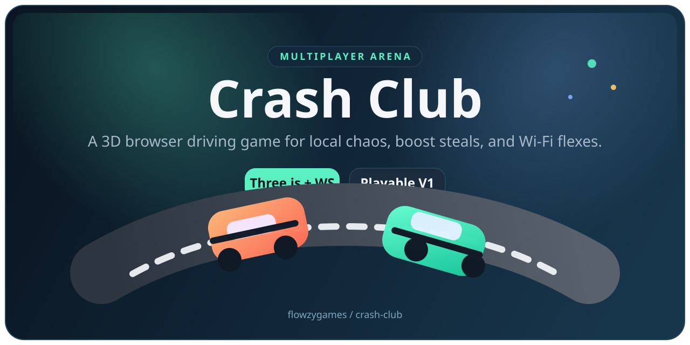
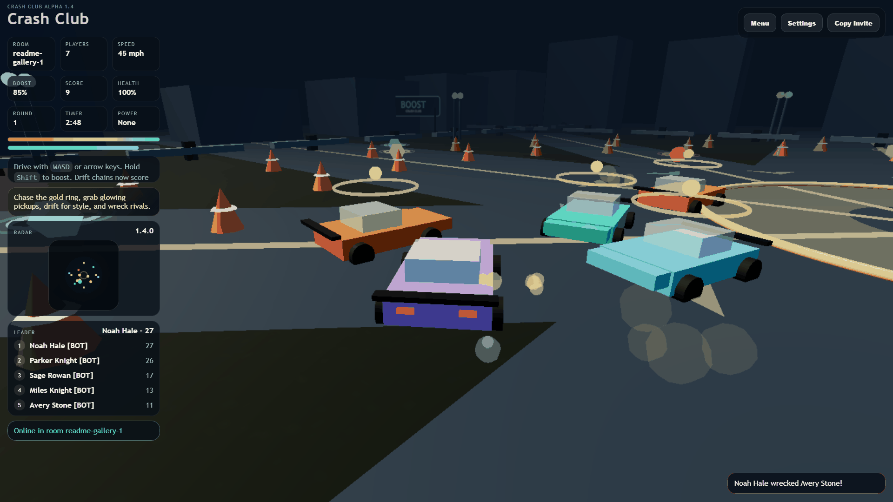
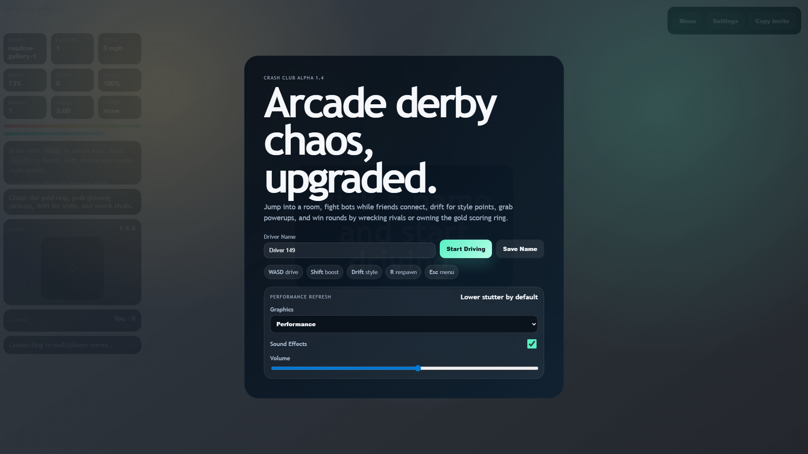
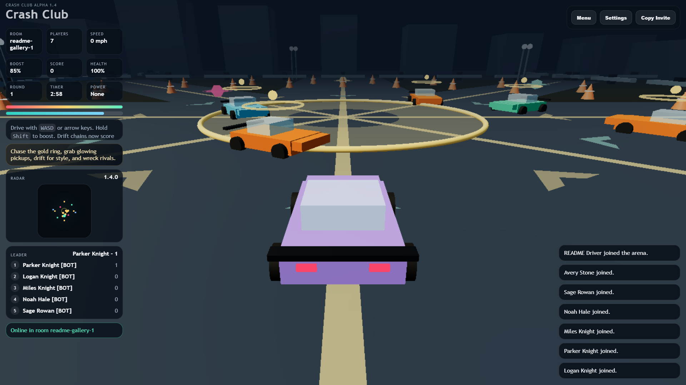
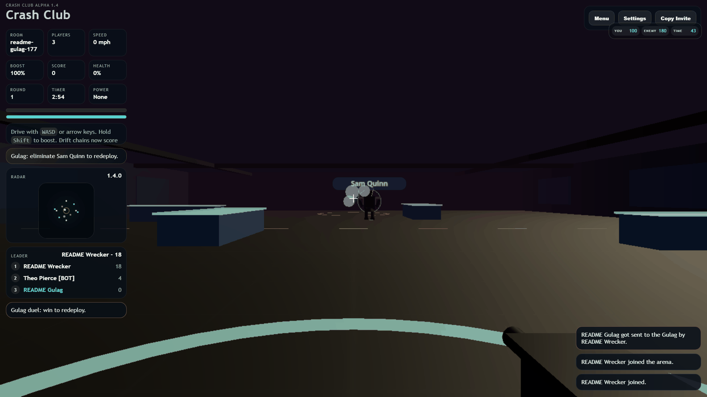

# Crash Club

  

  <strong>A multiplayer 3D browser driving arena built for quick browser chaos.</strong>

  <strong>THIS PROJECT IS NO LONGER OPEN SOURCE. THE SOURCE CODE, ASSETS, BRANDING, AND PROJECT FILES ARE NOT LICENSED FOR COPYING, REUSE, MODIFICATION, REDISTRIBUTION, OR REHOSTING.</strong>

  <strong>Play the official public version here:</strong> 
  <a href="https://crash-club.vercel.app/"><strong>https://crash-club.vercel.app/</strong></a>

  
  
  
  
  
  

> Crash Club is public so people can see and play the project. It is not public as an open-source codebase.

## Play Now

  <a href="https://crash-club.vercel.app/"><strong>Play Crash Club in your browser</strong></a>

Crash Club is a 3D browser-based car combat arena where players drift, smash rivals, grab powerups, fight for the scoring ring, and get a second chance in an FPS-style Gulag after getting wrecked.

## Gameplay Preview

  

## What It Is

- A multiplayer 3D browser driving arena.
- A quick-play arcade combat game built around drifting, wrecks, powerups, and ring control.
- A public playable game, not an open-source project.
- Built with Node.js, Three.js, and realtime WebSockets.

## Highlights

| Feature | What It Means |
| --- | --- |
| Browser play | The official public build runs at [crash-club.vercel.app](https://crash-club.vercel.app/). |
| Multiplayer rooms | Players can join shared rooms and play together. |
| Bot-filled matches | Rooms stay active even during solo testing. |
| Powerups | Boost, repair, shield, and slam create tactical moments. |
| Score ring | The center ring gives players a reason to fight for control. |
| Gulag redeploy | Destroyed players can earn a second chance through a compact FPS duel. |
| Podium rounds | The top three finishers get a podium moment before the next round. |

## Screenshots

  

  

  

## Technology

Crash Club uses:

| Layer | Technology |
| --- | --- |
| Realtime server | Node.js |
| Multiplayer transport | WebSockets |
| 3D rendering | Three.js / WebGL |
| Public frontend hosting | Vercel |
| Live backend hosting | Render |

## License And Source Use

**Crash Club is no longer open source.**

The project is made available for public play only. You may play the official game and share official links to it, but you may not copy, modify, redistribute, rehost, reuse, extract, or create derivative works from the source code, assets, branding, screenshots, game logic, or other project materials without prior written permission from flowzygames.

See [LICENSE](./LICENSE) for the full play-only license terms.

## Official Link

  <strong>Play Crash Club:</strong> 
  <a href="https://crash-club.vercel.app/"><strong>https://crash-club.vercel.app/</strong></a>

